<iframe width="100%" height="468" src="//player.bilibili.com/player.html?isOutside=true&aid=995248168&bvid=BV1ps4y1d73V&cid=1100442017&p=38"  crolling="no" border="0" frameborder="no" framespacing="0" allowfullscreen="true"></iframe>

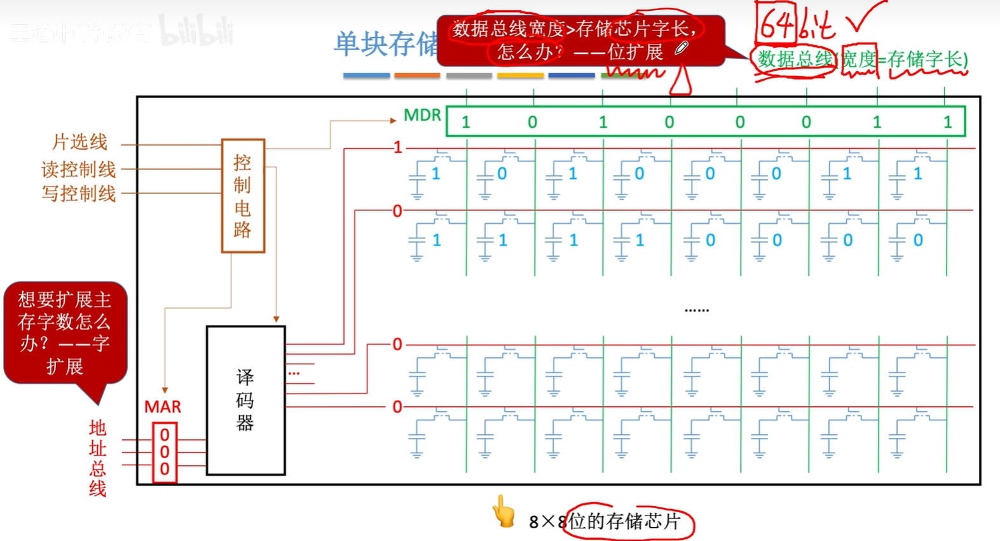
- ## 主存储器与CPU的连接
    - 存储器芯片的输入输出信号
    - 增加主存的存储字长-位扩展
    - 增加主存的存储字数-位扩展

>之前我们说过，我们应该尽可能地保持数据总线的宽度和主存的存储字长，以便更好发挥性能。
>若数据总线宽度 > 存储芯片字长怎么办？
>答案是用到位扩展。 

:::note
通过多块存储芯片的合理连接，我们可以让整个主存的存储字长扩展为和数据总线宽度一致。
:::

### 存储器芯片的输入输出信号

:::note
存储芯片当中各种输入信号和输出信号常用的英文缩写，如果有横线说明低电平有效，没横线说明高电平有效。
:::

如果此时我们已经买到了一块`8Kx1位`的存储芯片，应该如何和CPU连接呢？

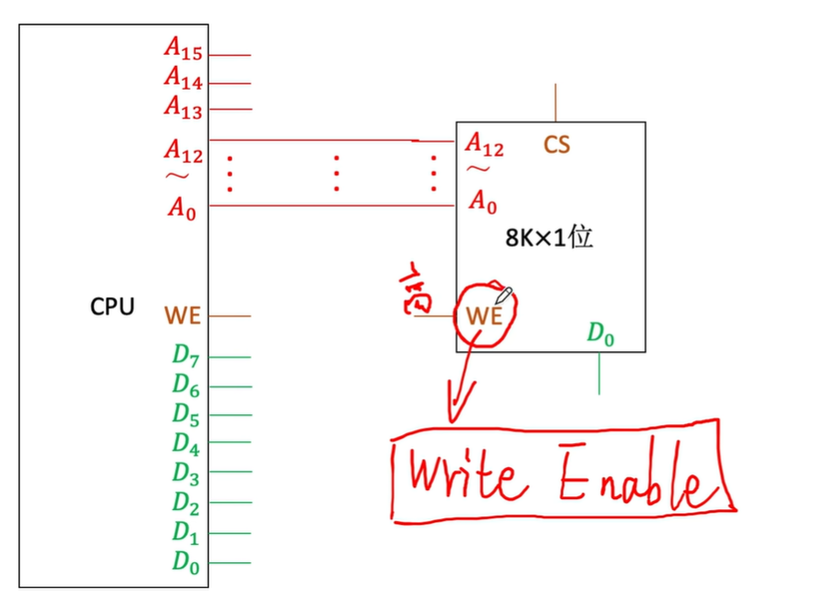

### 增加主存的存储字长-位扩展

8K对应的二进制应该是`2^13`，所以需要13根地址线来表示这8K个地址。

因此这块存储芯片对外暴露出的地址线的引脚是A0~A13，共13条。

WE头上无横线，说明高电平有效，此时CPU才往里面写数据。而低电平时，表示CPU从中读数据。同样，CPU也会有一个金属引脚来发送读写控制信号。（通过控制总线）

虽然CPU可以通过数据总线同时读或者写`8bit`的数据，由于存储芯片的限制，每次只能通过数据总线传送`1bit`，也就是数据总线的传输能力利用得很不充分。

CS，片选信号，头上无横线说明高电平有效，同样一根。

此时每次只能读或写一位的数据，主存的存储字长为`1bit`。

给主存再加上一块相同型号的存储芯片，由该线路可同时工作。存储字长拓展为了2位。

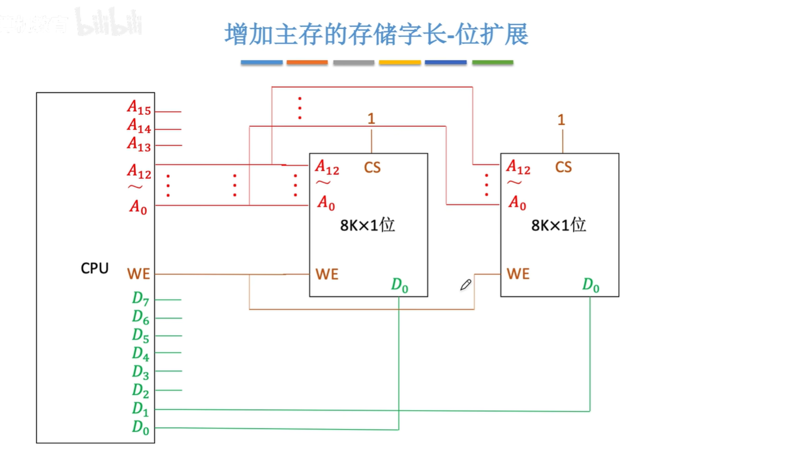

同样添加同类型的六块芯片，得到这样的连接，这样方式就称为**位扩展**。 
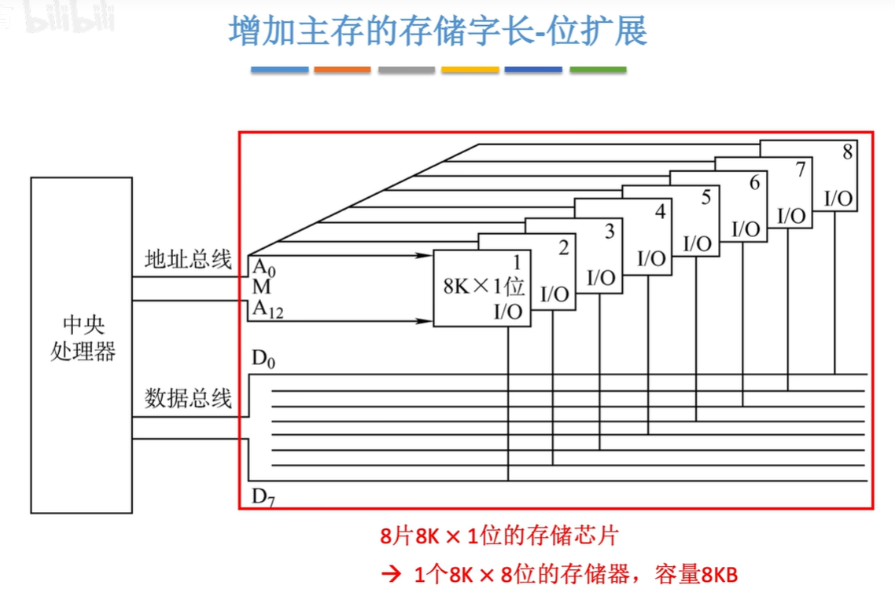

### 增加主存的存储字数-字扩展

假设现在的存储芯片字长为8位，数据的宽度和CPU能够处理的宽度完美匹配，则不需要进行位扩展。因为**数据总线的能力已经被使用到极致了**。

同样，由于有8K个存储单元，需要有13位的地址信息。

接下来再给片选信号加一个高电平，存储芯片即可正常工作。

我们发现，CPU还有三个地址位的信息没有被利用到（即A13~A15）。

这个CPU的MAR本来是有16位，i.e. 拥有`2^16`的寻址能力，我们却只利用了13位，没有完全发挥。
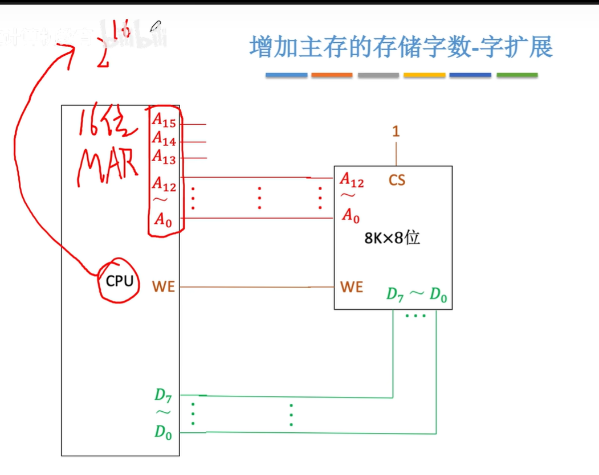

同样我们按位扩展的思路，试试看能不能解决问题。

把低位的13根地址线也连到这块芯片上，第二块芯片的数据同样通过数据总线传送给CPU，
读写控制信号也连起来，再给它一个高电平信号。

现在，当CPU给出一个全为0的地址后，这个地址会同时传给左边和右边，而由于此时这两块芯片的片选信号都是1，都在工作。因此这两块芯片的0号存储单元的8个比特的信息都会顺着数据总线传给CPU，导致数据总线冲突。

如何解决这个问题，关键在于**片选信号的使用**。

改造这个电路，把A13的地址信息连到左边这块芯片，A14连到右边这块芯片。

由于片选信号是高电平有效，因此当A13和A14分别为1和0的时候，意外着左边的片选信号有效，而右边无效。

这种情况下，CPU提供的13号地址只会读取左边这块芯片对应存储单元的`8bit`的数据。

换种情况，A13为0，A14为1，则右边被选中，左边不工作。此时CPU提供的低13位地址，指明了右边芯片的存储单元。
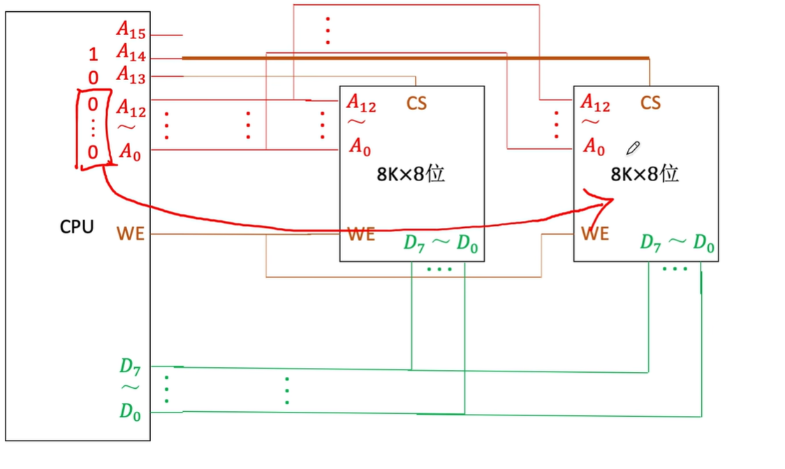

现在问题已经解决了（？），**但是事情并没有这么简单**......

 如果此时我们给A13，A14输入的都是1，两块芯片都会被选中，那就又出现了之前的问题：两边会同时读或者同时写数据。
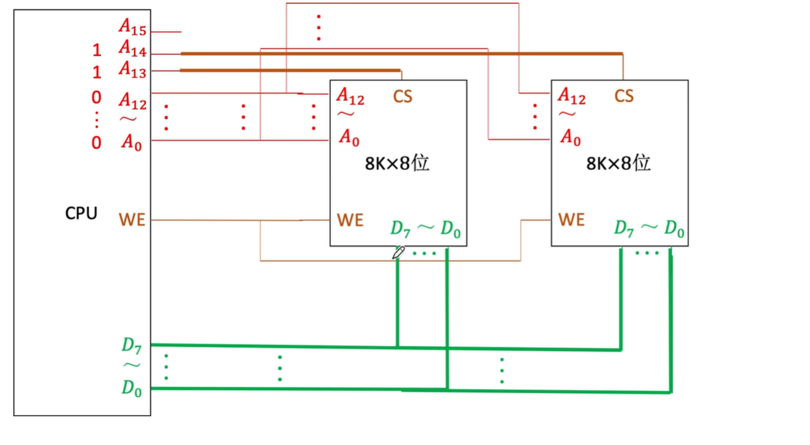

因此，我们只能允许A13，A14的情况为下表格情况：

| A13 | A14 | State   |
|-----:|-----:|:------|
| 0   | 0   | NO ❌ |
| 0   | 1   | Yes ✅ |
| 1   | 0   | Yes ✅ |
| 1   | 1   | NO ❌ |

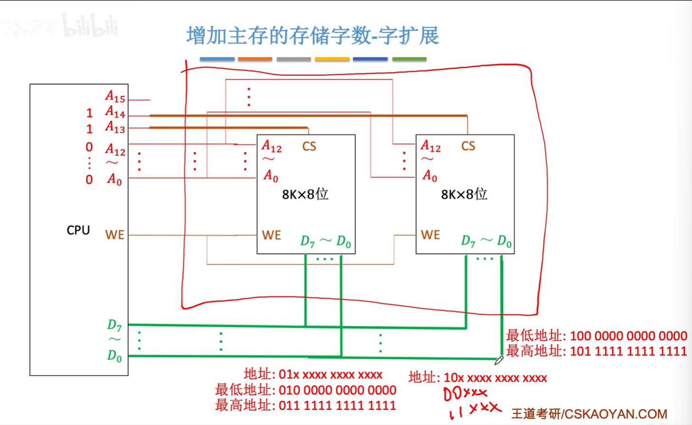

也就是说，这个存储器中00开头和11开头的地址不能使用，所以这种连线方法有待改进，我们称为**线选法**（Which means we have to choose a special address to be a chip select signal），如果CPU有n条多余的地址线，采用这种方法只能有n个片选信号。

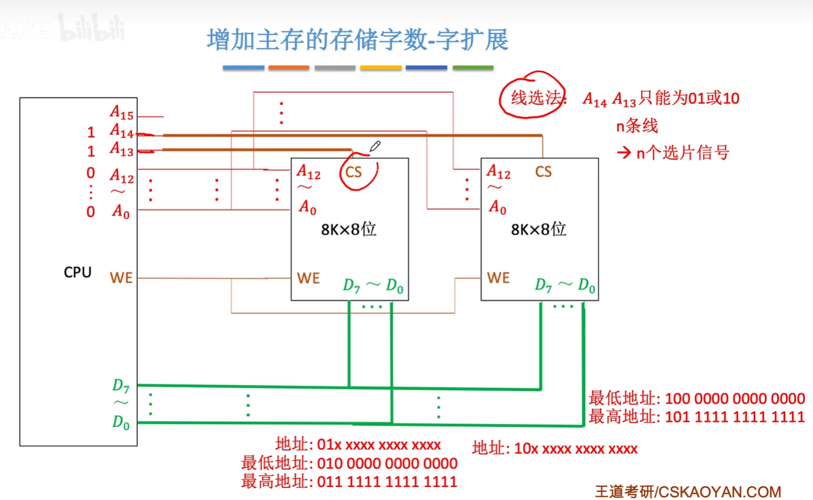

如果继续改造，A13流向右边的电路中加一个非门，即可做到A13为1时，左边为1，右边为0，反之亦然。
:::note
画非门前面要有一个小圆圈。

因此如果片选线是低电平有效，画图时在芯片的头上也画一个小圆圈。 
:::

可以发现，改造之后，整个主存的地址空间是连续的。而这个改造的小电路可以看作是一个**1-2译码器**，也就是我们输入一位的地址信息，这个地址信息会呈现出`2^1`种不同的状态，会被译码器分别翻译为要么上面这条线高电平，要么下面这条线高电平。
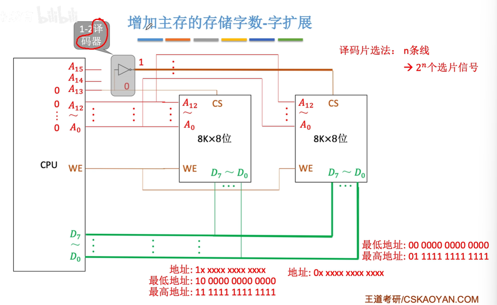

顺着这个思路往下优化，使用译码器处理CPU的高位地址部分，这种方法称为**译码器片选法**，如果CPU给出n位的地址信息，通过译码器的翻译，可以得到`2^n`个片选信号。
 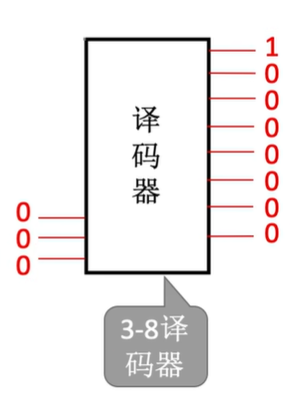
 
 输入3个信号（代表地址）得到8个地址，让其中一个地址得到高电平信号的译码器，叫做**3-8译码器**。

 类似地，也可以有2-4译码器等。
:::note
也可以逆过来编号。
:::
  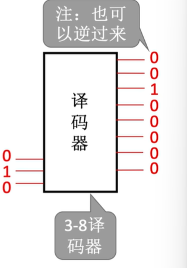

 
### 主存容量扩展-字位同时扩展
结合了字扩展和位扩展，通常考察存储芯片的选择。

---

###  知识回顾

---
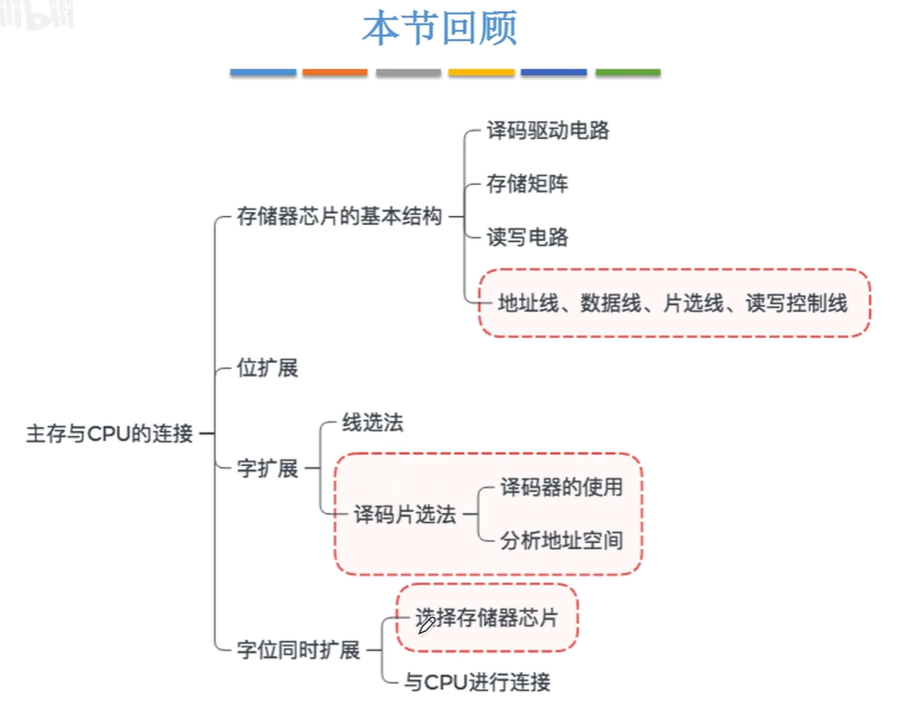

### 补充：译码器

译码器的两种画法如图，注意芯片和译码器的配套。

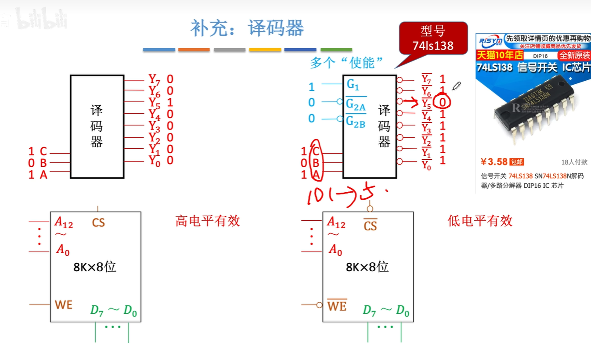

实际当中CPU和主存是这么配合工作的：由于译码器需要多个“使能”才能工作，CPU通过MREQ（Memory Request）控制“使能”，以此控制片选信号的生效时间，以此来读出存储芯片中的数据。 

先送出地址信号，包括低13位，和高3位。由于是电信号有可能不稳定，因此需要等一段时间电流稳定之后再发出储存请求信号MERQ，让译码器的某一个选通线有效（如Y4）， 从而保证当一块存储芯片被选通时，其接收到的地址信号（电信号）一定是稳定的。

这就是译码器使能端的作用。

74LS138这个型号的译码器芯片就如图所示。
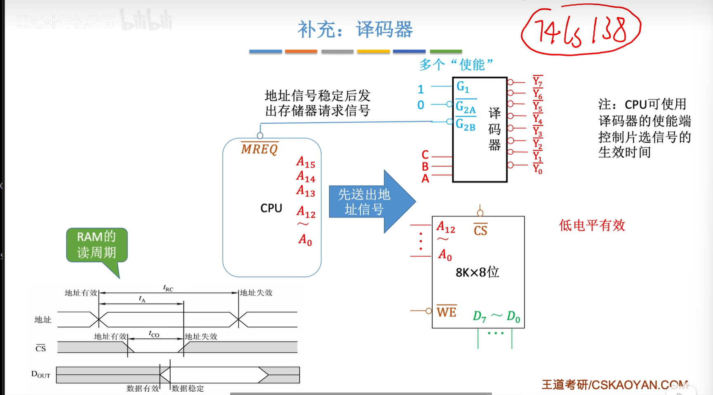

:::tip
请与RAM的读写周期这个图像结合起来理解。

第一行表示CPU的MERQ，第二行表示存储单元的CS，第三行表示数据总线

灰色表示没有数据输出。

斜坡表示低电平时期。

既有往上又有往下的斜坡表示输出的数据可能为0，1，有很多0和1。
:::