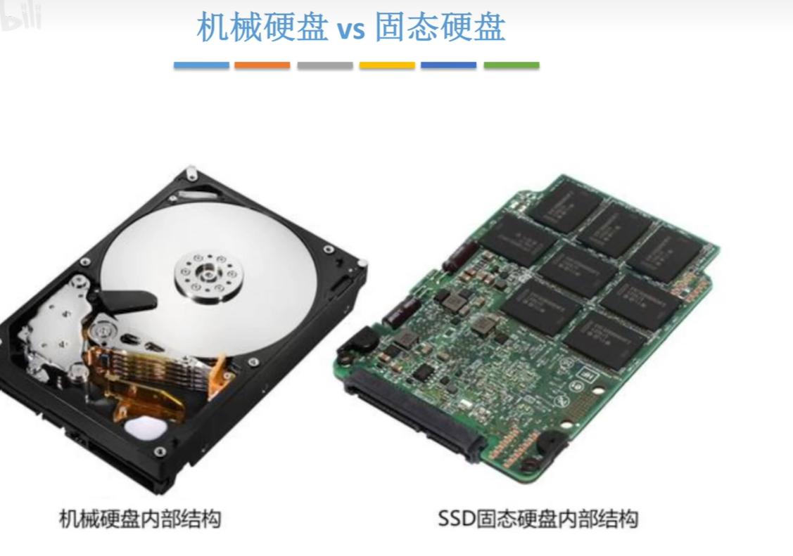
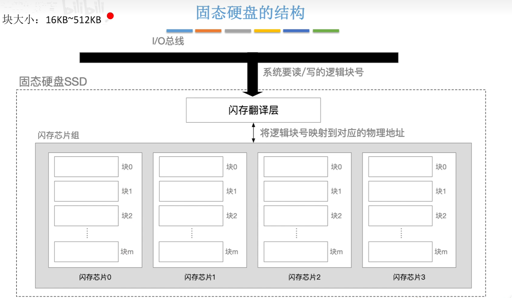
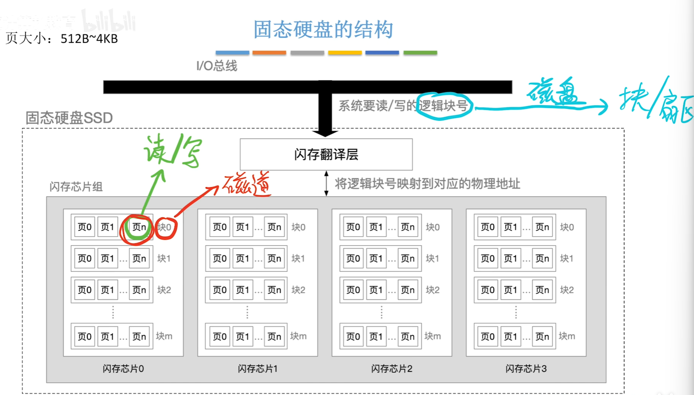
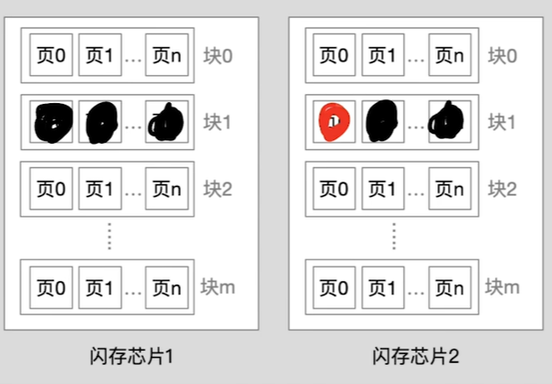
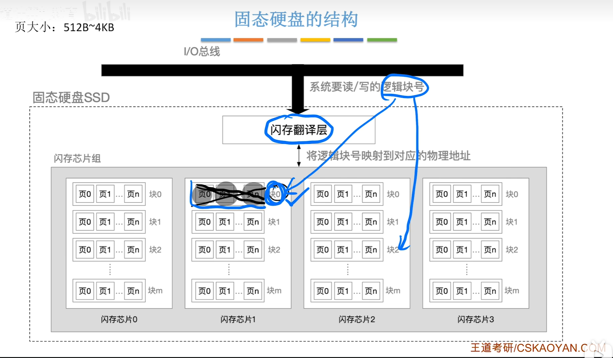
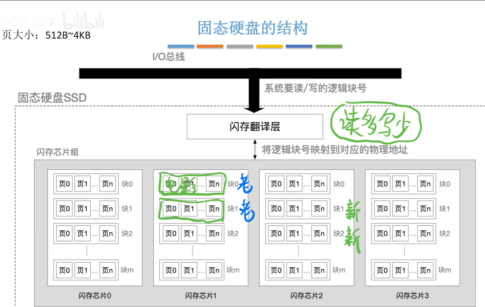

<iframe width="100%" height="468" src="//player.bilibili.com/player.html?isOutside=true&aid=995248168&bvid=BV1ps4y1d73V&cid=1100442826&p=40" crolling="no" border="0" frameborder="no" framespacing="0" allowfullscreen="true"></iframe>

:::note
其中，读写性能特性和磨损均衡技术，这两个部分是操作系统明确指明要求掌握的。
:::

- ## 固态硬盘SSD
    - 原理
    - 组成
    - 读写功能特性
    - 与机械硬盘相比的特点
    - 磨损均衡技术

### 原理

固态硬盘原理基于闪存技术，如U盘。

### 组成，读写功能特性和与机械硬盘相比的特点

每一块闪存芯片内部由若干个数据块组成，块大小为16KB-512KB，块又可拆分成页，页大小为512B-4KB。

系统对固态硬盘的读写以页为单位，每次要读（写），系统通过I/O总线指明要写的逻辑块号是多少。

闪存芯片组的块可对应为磁盘的磁道，页可对应为磁盘的扇区。

以块为单位进行擦除，擦干净之后，其中的每一页才可以再次写入数据。

这会导致其他页的数据也跟着消失，因此仅仅如此是不合理的。

固态硬盘的处理方式是：把其他块的数据先复制到另一块对应的位置，再把想写入的新数据写到这个地方，接着把原来的块擦除。

为了使地址的映射关系依然保持正确，在数据迁移之后，闪存翻译层会把逻辑块号映射到新的位置，原有的映射舍弃。

所以，对于固态硬盘来说，一个逻辑地址实际对应的物理位置有可能会变，只不过闪存翻译层会把映射关系修正。

### 磨损均衡技术

如果一个块被擦除的次数太多了，把其中的数据迁移到其他被擦除的次数较少的地方，以提高使用寿命，这就是**磨损均衡技术**中的**动态磨损均衡**。

磨损均衡技术也会在后台监控哪些块被读了多少次，把读多写少的数据迁移到较老的数据块里，让较新的块承担更多写操作任务，被称为**静态磨损均衡**。

  

---

###  知识回顾

---

