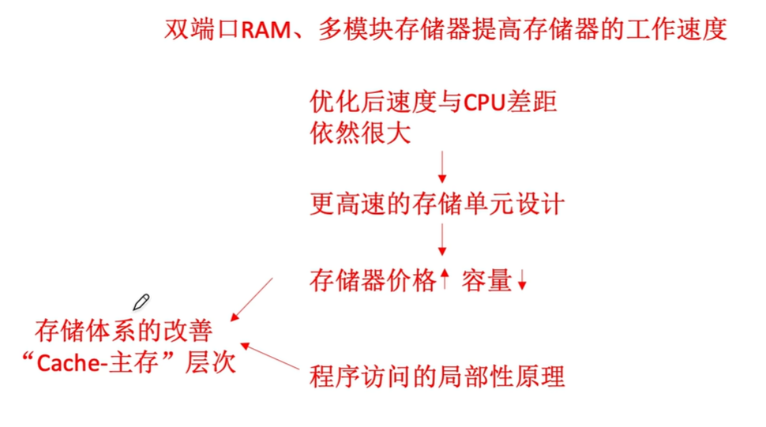
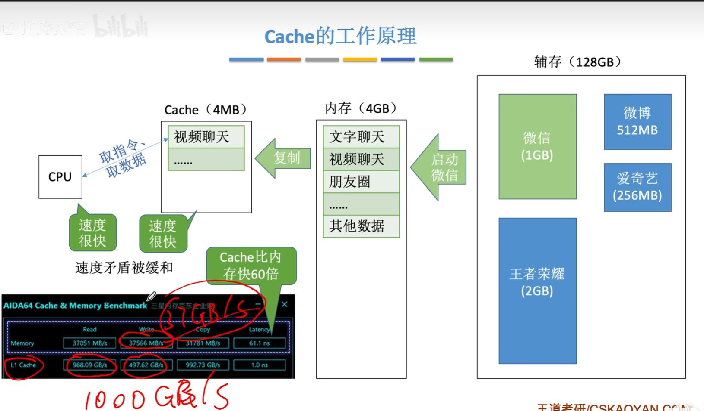
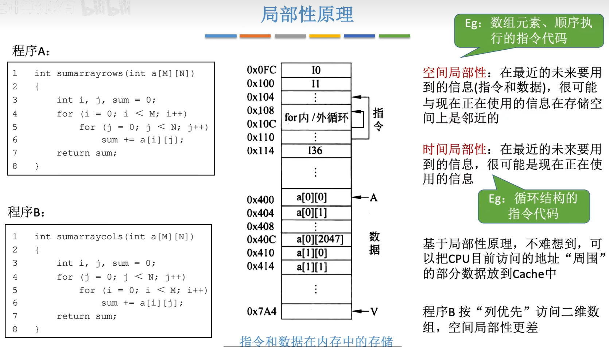
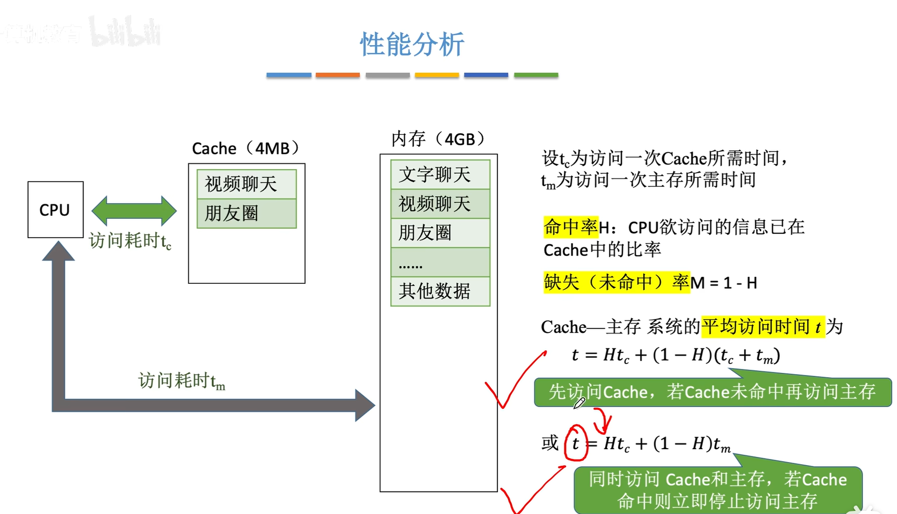
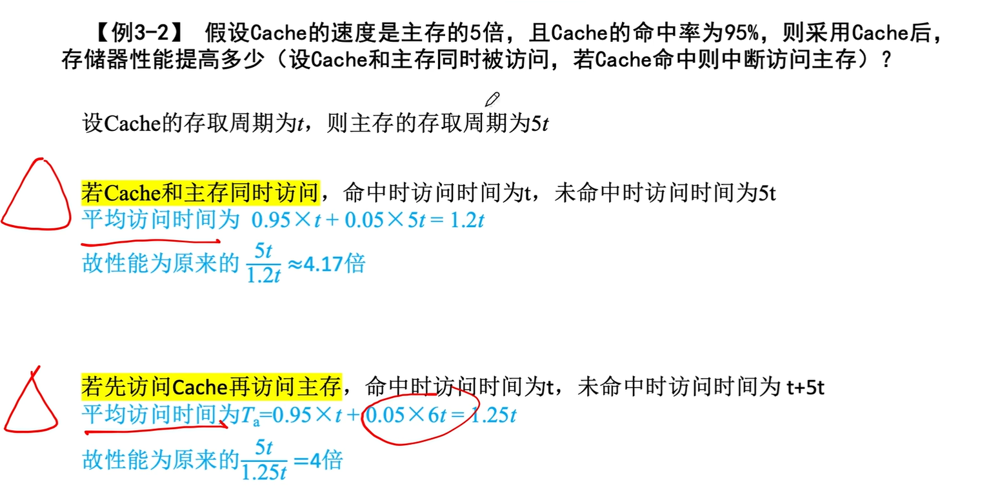
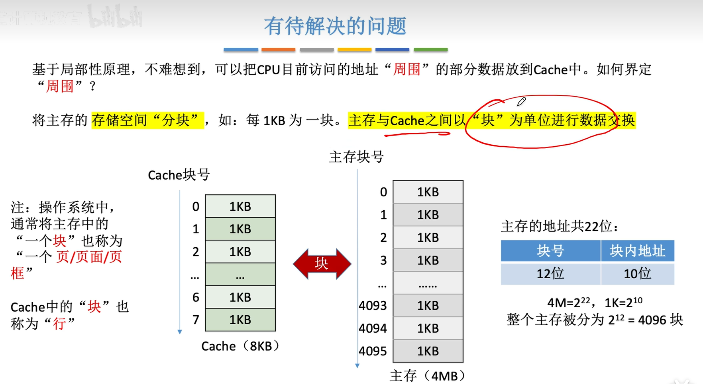
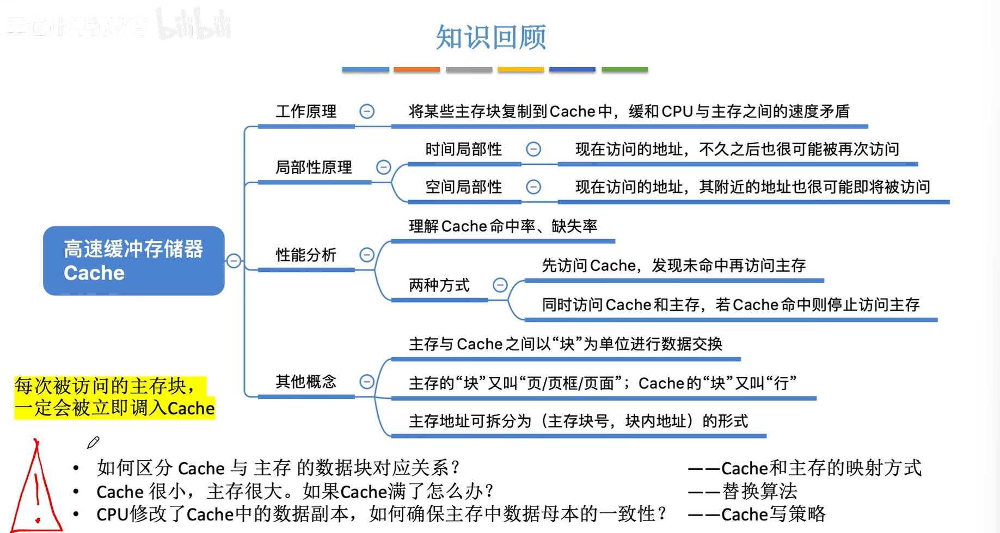

<iframe width="100%" height="468" src="//player.bilibili.com/player.html?isOutside=true&aid=995248168&bvid=BV1ps4y1d73V&cid=1100443036&p=41"  crolling="no" border="0" frameborder="no" framespacing="0" allowfullscreen="true"></iframe>

:::note
复习：基于程序的局部性原理，增加Cache层缓和CPU和主存之间的速度矛盾。
:::

- ## Cache的基本原理
    - Cache的工作原理
    - 局部性原理
    - 性能分析
    - 与机械硬盘相比的特点
    - 磨损均衡技术

    
### Cache的工作原理 
 

:::note
实际上，Cache被集成在CPU内部，用SRAM实现，速度快，成本高。
:::
### 局部性原理 

程序的局部性原理解释。

### 性能分析 

对于CPU想要的数据，如果直接能在Cache中找到，就被称为**Cache命中**，与之对应的指标叫**命中率**H，相对的也有缺失（未命中率）M。

因此可以得到Cache-主存系统的平均访问时间为：

$$ t = Ht_c + (1 - H)(t_c + t_m) $$

_（这是CPU先访问Cache，若未命中再访问主存时的公式。）_

或
$$ t = Ht_c + (1 - H)t_m $$

_（这是CPU同时访问Cache和主存的公式。）_

:::warning
也就是说，CPU的访问方式的不同（什么时候访问主存）会导致性能有一点区别，请注意审题。
:::

###  有待解决的问题

**主存与Cache之间以“块”为单位进行数据交换。**

主存地址可拆分为（主存块号，块内地址）的形式。

对于`4MB`的主存，会发现若按`1KB`分块，块内地址刚好有`10位`，被分为`4096`块，刚好有`12位`来表示块号。

:::note
每次被访问的主存块，一定会被立即调入Cache
:::

有待解决的问题：
1. 如何区分Cache与主存的数据块对应关系 -- Cache和主存的映射方式

2. Cache很小，主存很大。如果Cache满了怎么办？ -- 替换算法 

3. CPU修改了Cache中的数据副本，如何确保主存中数据母本的一致性？ -- Cache写策略

---

###  知识回顾

---

